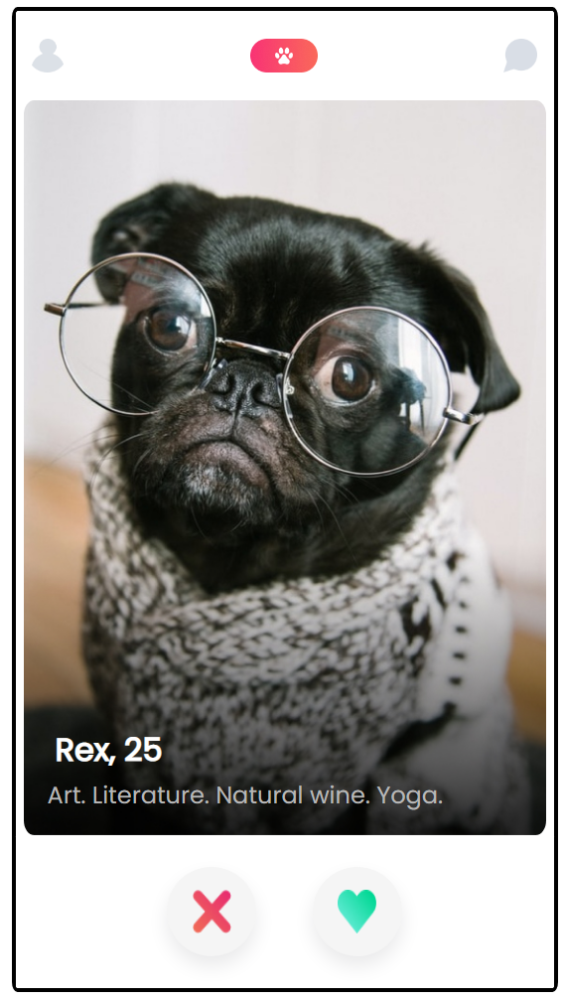
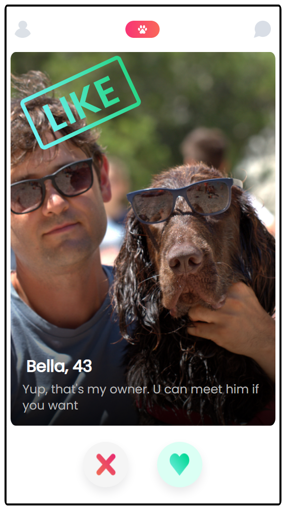
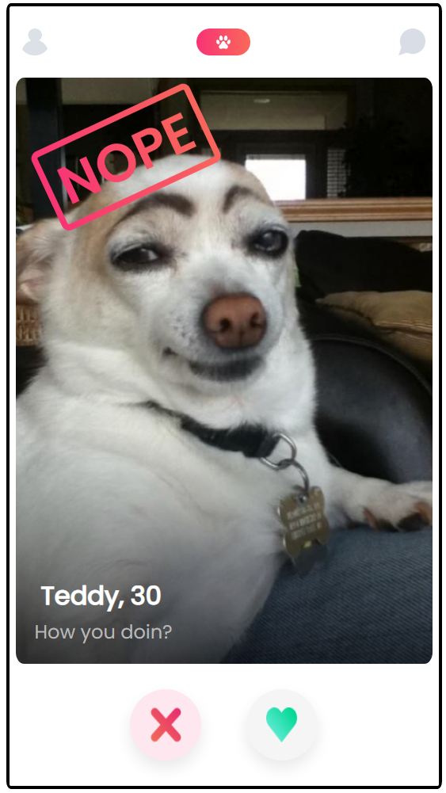
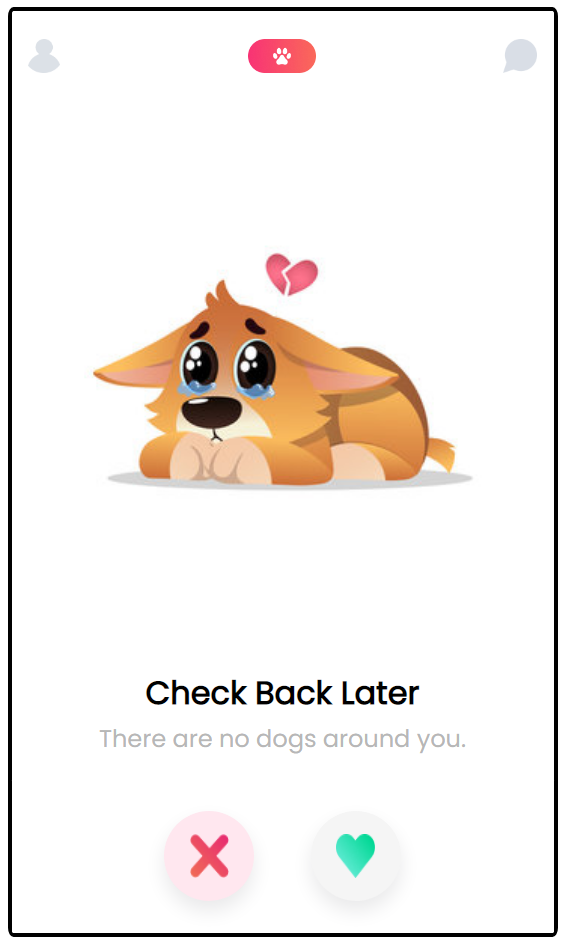

# Tindog

Tindog Project from [Scrimba](https://scrimba.com/learn/frontend)'s Next-level JavaScript module.

## Project Link

[Project Link] https://tindog-scrimba-project.netlify.app/ Hosted using Netlify 

## Previews

Profile

Profile that's been liked

Profile that's been swiped

End Screen when there's no more profiles 

## Project Functionality

- Display tindog profiles with an profile picture, name, age, and bio.
- Allow users to either like or swipe profiles using two buttons. A badge that says like or nope will display when either button is pressed.
- Displays an end screen when all profiles have been liked or swiped. 
